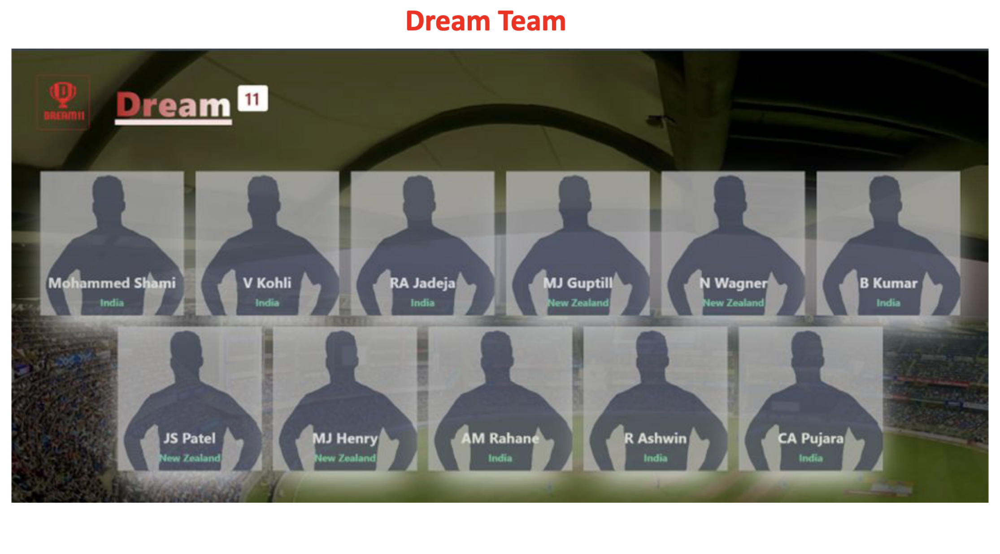

# Dream11 IPL Team Predictor

A web application that helps you build optimal Dream11 fantasy cricket teams for IPL matches using an intelligent player selection algorithm.

## Features

- **Team Selection**: Choose two IPL teams and venue for the match
- **Player Database**: Comprehensive player data for all major IPL teams (MI, CSK, RCB, LSG, DC, KKR, PBKS, RR)
- **Smart Algorithm**: Automatically selects the best 11 players from your chosen 11-22 players based on:
  - Player performance points
  - Match format (T20, ODI, Test)
  - Venue  
- **Interactive UI**: Clean, responsive interface for easy team building

## Project Structure

```
Dream11_App/
├── backend/
│   ├── main.py           # FastAPI application and routing logic
│   ├── player_data.py    # Player database and team selection algorithm
│   └── __init__.py
├── frontend/
│   ├── templates/        # HTML templates (Jinja2)
│   └── static/           # CSS, JS, and images
└── requirements.txt      # Python dependencies
```

## Installation

1. **Clone the repository**
   ```bash
   git clone <repository-url>
   cd Dream11_App
   ```

2. **Install dependencies**
   ```bash
   pip install -r requirements.txt
   ```

3. **Run the application**
   ```bash
   uvicorn backend.main:app --reload
   ```

4. **Access the app**
   Open your browser and navigate to `http://localhost:8000`

## How It Works

1. **Login**: Start at the login page
2. **Select Teams**: Choose two IPL teams and match venue
3. **Choose Players**: Select 11-22 players from both teams
4. **Get Prediction**: The algorithm automatically picks the optimal 11-player Dream11 team
5. **View Results**: See your predicted team with player positions and points

## Team Selection Algorithm

The algorithm considers:
- **Performance Points**: Player statistics and historical performance

## Technologies Used

- **Backend**: FastAPI, Python
- **Frontend**: HTML, CSS, JavaScript, Jinja2 templates
- **Server**: Uvicorn (ASGI server)

## Requirements

- Python 3.8+
- FastAPI 0.118.0
- Uvicorn 0.37.0
- Jinja2 3.1.6
- See `requirements.txt` for full list


Project Presentation:

[](./84_m1_dream11_presentation.pdf)


Drive link to content of code : 
https://drive.google.com/file/d/18l5QfqhE8V0sk9Blo4rfHjVQOcro4H-B/view?usp=drive_link

## License
This project is for educational purposes.

